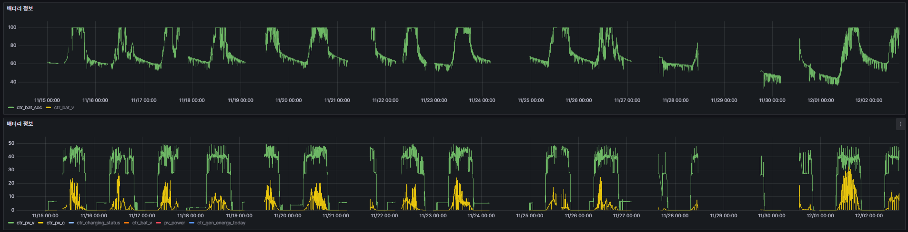
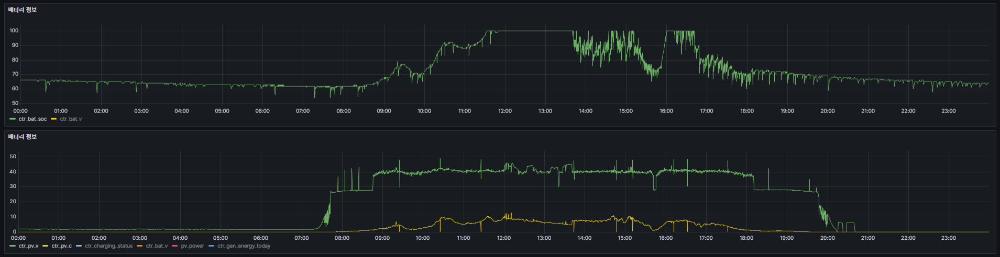
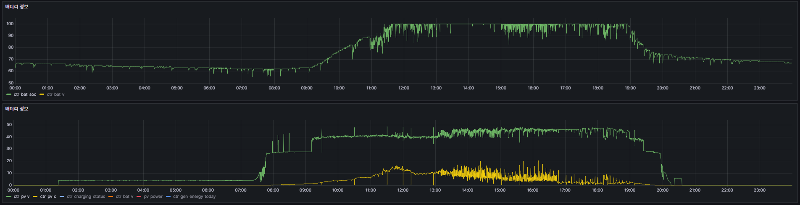
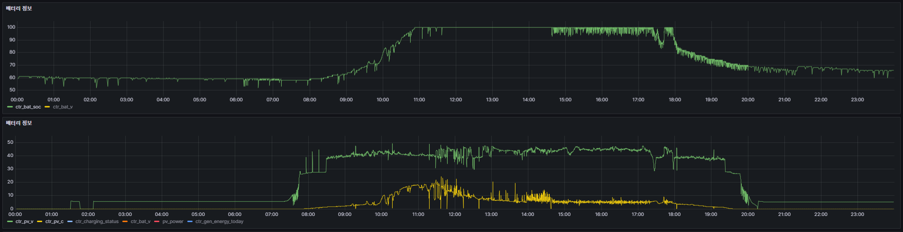
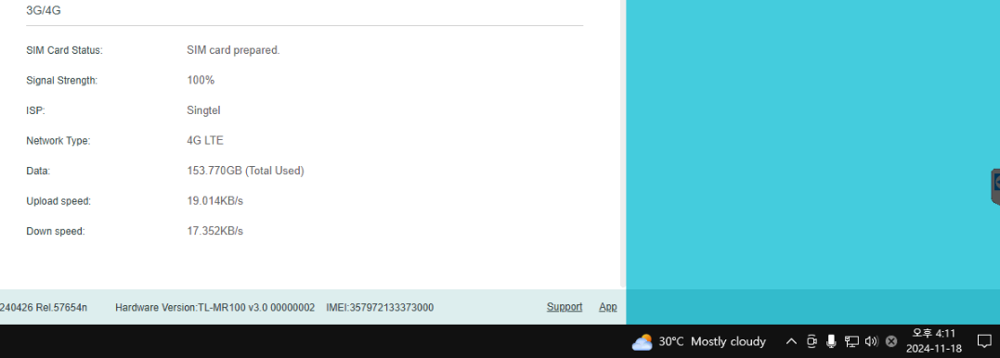
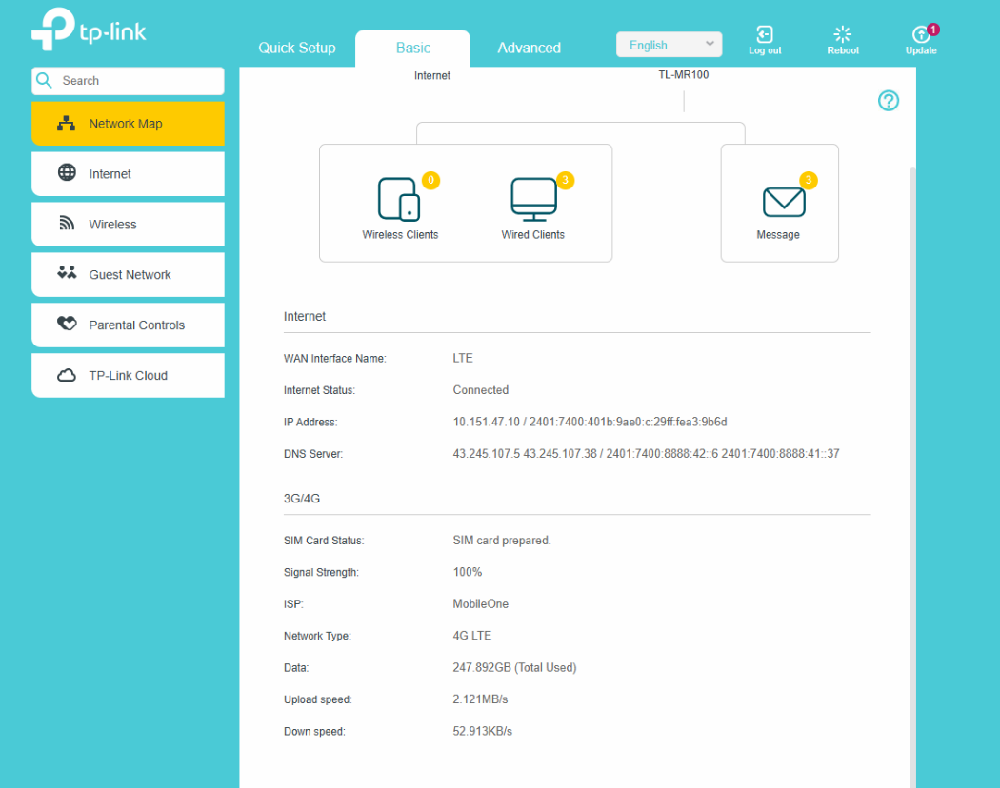

# 싱가포르 에코봇 관련 데이터

## 전력 관련
### 평균 일일 배터리 사용량

- 상단 : 배터리 잔량 
- 하단 : 충전량
- 운영 외 시간(1900 ~ 1000) 대기전력 및 위치사수에 사용하는 배터리 소모량 약 25%

> 11월 15일 ~ 12월 2일

> 11월 18일 배터리 잔량 및 충전량

> 11월 20일 배터리 잔량 및 충전량

> 11월 23일 배터리 잔량 및 충전량

## 통신 관련
### 일일 데이터 사용량
> 11월 18일까지 사용한 데이터

- 사실상 설치기간동안 150기가 정도 사용

> 12월 2일가지 사용한 데이터

- 약 2주간 94기가 정도 사용함
- 즉, 14일간 매일 6.7기가 정도 사용
